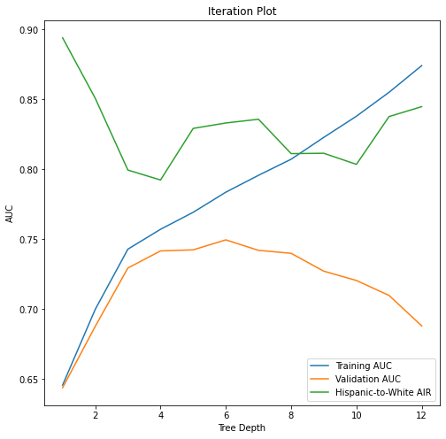

# GWU_DNSC6301_Group24

# Credit Line Increase Model Card

### Basic Information

* **Persons or organization developing model**: Adeel, `adeel@ai.edu`, Eric, `eric@newzealand.edu`, Estella, `estella@washington.edu`, Swapnil, `swapnil@washington.edu`
* **Model date**: August, 2022
* **Model version**: 1.1
* **License**: MIT
* **Model implementation code**: [Project24.ipynb](Project24.ipynb)

### Intended Use
* **Primary intended uses**: This model is an *example* probability of default classifier, with an *example* use case for determining eligibility for a credit line increase. 
* **Primary intended users**: Students in Group 24 for GWU DNSC 6301 bootcamp.
* **Out-of-scope use cases**: Any use beyond an educational example is out-of-scope.

### Training Data

* **Data dictionary:** 

| Name | Modeling Role | Measurement Level| Description|
| ---- | ------------- | ---------------- | ---------- |
|**ID**| ID | int | unique row indentifier |
| **LIMIT_BAL** | input | float | amount of previously awarded credit |
| **SEX** | demographic information | int | 1 = male; 2 = female
| **RACE** | demographic information | int | 1 = hispanic; 2 = black; 3 = white; 4 = asian |
| **EDUCATION** | demographic information | int | 1 = graduate school; 2 = university; 3 = high school; 4 = others |
| **MARRIAGE** | demographic information | int | 1 = married; 2 = single; 3 = others |
| **AGE** | demographic information | int | age in years |
| **PAY_0, PAY_2 - PAY_6** | inputs | int | history of past payment; PAY_0 = the repayment status in September, 2005; PAY_2 = the repayment status in August, 2005; ...; PAY_6 = the repayment status in April, 2005. The measurement scale for the repayment status is: -1 = pay duly; 1 = payment delay for one month; 2 = payment delay for two months; ...; 8 = payment delay for eight months; 9 = payment delay for nine months and above |
| **BILL_AMT1 - BILL_AMT6** | inputs | float | amount of bill statement; BILL_AMNT1 = amount of bill statement in September, 2005; BILL_AMT2 = amount of bill statement in August, 2005; ...; BILL_AMT6 = amount of bill statement in April, 2005 |
| **PAY_AMT1 - PAY_AMT6** | inputs | float | amount of previous payment; PAY_AMT1 = amount paid in September, 2005; PAY_AMT2 = amount paid in August, 2005; ...; PAY_AMT6 = amount paid in April, 2005 |
| **DELINQ_NEXT**| target | int | whether a customer's next payment is delinquent (late), 1 = late; 0 = on-time |

* **Source of training data**: GWU Blackboard, email `jphall@gwu.edu` for more information
* **How training data was divided into training and validation data**: 50% training, 25% validation, 25% test
* **Number of rows in training and validation data**:
  * Training rows: 15,000
  * Validation rows: 7,500

### Test Data
* **Source of test data**: GWU Blackboard, email `jphall@gwu.edu` for more information
* **Number of rows in test data**: 7,500
* **State any differences in columns between training and test data**: None

### Model details
* **Columns used as inputs in the final model**: 'LIMIT_BAL',
       'PAY_0', 'PAY_2', 'PAY_3', 'PAY_4', 'PAY_5', 'PAY_6', 'BILL_AMT1',
       'BILL_AMT2', 'BILL_AMT3', 'BILL_AMT4', 'BILL_AMT5', 'BILL_AMT6',
       'PAY_AMT1', 'PAY_AMT2', 'PAY_AMT3', 'PAY_AMT4', 'PAY_AMT5', 'PAY_AMT6'
* **Column(s) used as target(s) in the final model**: 'DELINQ_NEXT'
* **Type of model**: Decision Tree 
* **Software used to implement the model**: Python, scikit-learn
* **Version of the modeling software**: Python version: 3.7.13
sklearn version: 1.0.2
* **Hyperparameters or other settings of your model**: 
The cutoff of lending money is 0.12 below which the accuracy gets hampered for the given dataset.


```
DecisionTreeClassifier(ccp_alpha=0.0, class_weight=None, criterion='gini',
                       max_depth=6, max_features=None, max_leaf_nodes=None,
                       min_impurity_decrease=0.0, min_impurity_split=None,
                       min_samples_leaf=1, min_samples_split=2,
                       min_weight_fraction_leaf=0.0, presort='deprecated',
                       random_state=12345, splitter='best')`
```
### Quantitative Analysis
* **Metrics used to evaluate the final model**: Confusion metrics 
* **Final values of the metrics for all data**: 
  * Training AUC: 0.87
  * Validation AUC: 0.69
  * Test AUC: 0.74 
  * Asian-to-White AIR: 0.98
  * Black-to-White AIR: 0.83
  * Female-to-Male AIR: 1.00
  * Hispanic-to-White AIR: 0.82

### Plots 


#### Correlation Heatmap


#### Tree Depth vs. Training and Validation AUC


### Viariable Importance


### Decision tree for human interpretation


### Ethical considerations:
* **Potential negative impacts of the model**:
  * **Math/Software Problems**: The importance chart showed that PAY_0 is a very important variable and this may cause the model to weight more on PAY_0 as making the decision.
  * **Real world risks**: The Adverse Impact may happen to people either it is indended or accidentally. And the AIR of Hispanic-to-White AIR is 0.82 which is greater than the 80/20 rule so the model is not affected by Adverse Impact. However, the rate is not 1.00 which means the model is still biased.
* **Potential uncertainties relating to the impact of using the model**:
  * **Math/Software Problems**: There are situations when our group members getting different data from the model when we test run it different times. The software version might cause the problem. 
  * **Real world risks**: The imporatnce for PAY_0 is extremely high, and the model may take that as key consideration. However, most people get their credit cards young and still learning to build credits. The consistency should be taking into account in real life.
* **Other unexpected results**: 
  * The Adverse Impact Ratio for Asian v.s. White 0.98 which means the Asian and White alomst have the same accecptance rate to the credit increase. 


